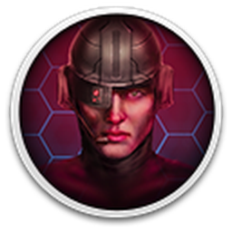

  

# Graphics

## Cursors
Progress: 🟩🟩🟩🟩🟩🟩🟩🟩🟩🟩 100% 7/7\
Seven cursor variants have been preserved:

  
  
  
  
  
  
  

## Icons
Progress: 🟩🟩🟩🟩🟩🟩🟩🟩🟩🟩 100% 3/3\
Three icon variants have been preserved:

  
  
  

## Fonts
Progress: 🟩🟩🟩🟩🟩🟩🟩🟩🟩🟩 100% 3/3\
Fonts are stored in `.FNX` files with a shading, gradient, or shadow effect (fat). Without the gradient applied, the text can be difficult to read. A readable (slim) version is also provided, as modern font formats do not support the gradient effect.

## Images
.ART Progress: 🟩🟩🟩🟩🟩🟩🟩🟩🟩🟩 100% 1/1\
.ANX Progress: ⬜⬜⬜⬜⬜⬜⬜⬜⬜⬜ 0%   0/746\
.BMX Progress: ⬜⬜⬜⬜⬜⬜⬜⬜⬜⬜ 0%   0/152

Progress so far: `.anx` & `.bmx` files contain image information with palette information being stored within `.plx` formats. It apears `.anx` format is for my complex visual information such as herc rotations with `.bmx` being used for more static content. The files are stored compressed complicateing the reading process however the issues have been mostly ironed out. 

Next step: Each image file needs to be matched with the correct palette information, although the two are only loosely tied together. It appears that the game selects the appropriate palette based on the current game screen, with the expectation that any newly loaded image content will inherit that palette. Another complication is that effects such as muzzle flashes and the HERCs' blinking lights appear to dynamically alter their palette colors.

## Color Palettes
.PLX Progress: ⬜⬜⬜⬜⬜⬜⬜⬜⬜⬜ 0% 0/31\
Color information needed for `.anx` & `.bmx` is being read from `.plx`.

Next step: Document the `.plx` format and export to the modern `.gpl` **GIMP Palette** format.

## Tools
### FNX Converter

Used to render and convert `.fnx` fonts into useable formats (`.png` & `.ttf`). 

### ART Converter

Used to render and convert `.art` fonts into a modern `.png` format. There is a single `.art` assest in the game being `SEQUEL.ART` used to promote Cyberstorm 2 when the player closes the game. This format is unique as it includes palete information where the common `.anx` & `.bmx` require external `.plx` palete files.

### Resource Hacker (External)
The game cursors were extracted using **Resource Hacker** and converted from `.cur` format to `.png` and `.ico` for easier viewing and use. The original game icon was a hexagon and was embedded within the `.exe` file. **Resource Hacker** was used to extract the icon and save it as a standalone `.ico` file.
